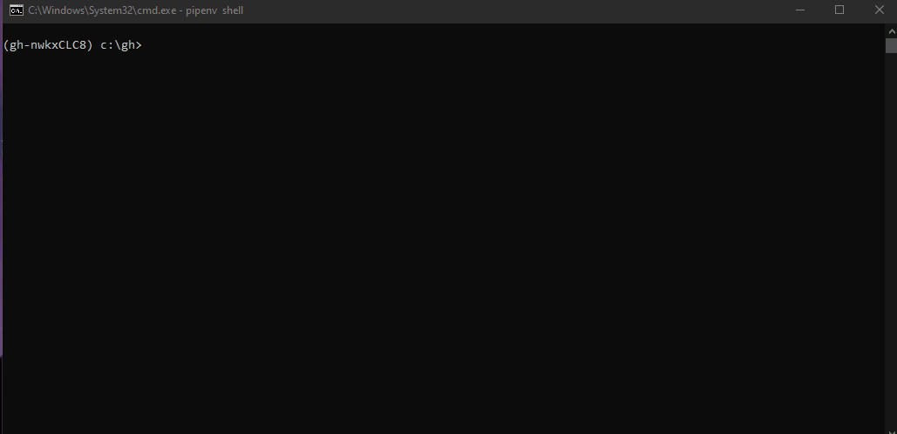

# GoodHound

```
   ______                ____  __                      __
  / ____/___  ____  ____/ / / / /___  __  ______  ____/ /
 / / __/ __ \/ __ \/ __  / /_/ / __ \/ / / / __ \/ __  / 
/ /_/ / /_/ / /_/ / /_/ / __  / /_/ / /_/ / / / / /_/ /  
\____/\____/\____/\__,_/_/ /_/\____/\__,_/_/ /_/\__,_/   
                                                         
```
> Attackers think in graphs, defenders think in actions, management think in charts.

GoodHound operationalises Bloodhound by determining the busiest paths to high value targets and creating actionable output to prioritise remediation of attack paths.

## Usage

### Quick Start
For a very quick start with most of the default options, make sure you have your neo4j server running and loaded with SharpHound data and run:
```
pip install goodhound
goodhound -p "neo4jpassword"
```
This will process the data in neo4j and output 3 csv reports in the current working directory.



## Documentation
All docs can be found in the [wiki](https://github.com/idnahacks/GoodHound/wiki)
